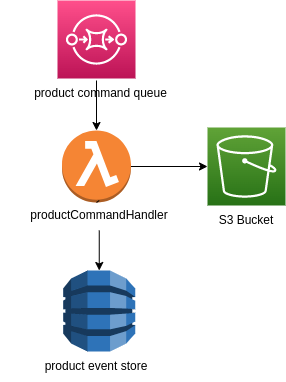

# Lambda Command Handler

This repository contains the code of the command handler which aims to manage a command, reconstruct the aggregate current state from the event store and apply the command to change aggregate state. The state change generates an event (for now we convert straightforward command to event) that is stored to the event store.

## Project Structure

The project follows the [Standard Go Project Layout](https://github.com/golang-standards/project-layout). 

- **./config/** 
    config that must be uploaded to an external storage (in this case the state machine configuration)
- **./internal/** 
    business logic specific to the application
    - **./eventStore/** 
    event store interface + dynamo db implementation
    - **./model/** 
    utility struct to parse json data
    - **./stateMahcineConfig/** 
    state machine config interface + s3 implementation
    - **./utils/** 
    utility functions to manage commands and events
- **./pkg/** 
    generic business logic
    - **./stateMachine/** 
    state machine interface + array implementation
- **./cmd/main.go**
    starting point of the application
- **Taskfile.yaml**
    task file 
    
## Taskfile

In the repository there's the taskfile with commands alias that help us during development. Here's the list of them:

- **build**
         build go binary
- **zip-linux**
        zip go binary on linux systems
- **zip-win**
        zip go binary on windwos systems
- **update-deploy**
        deploy zip to lambda

## Configuration

| Key      | Value |
| ----------- | ----------- |
| DYNAMO_TABLE_NAME      | "Dynamo DB Product table name"       |
| S3_BUCKET_NAME      | "State machine config s3 bucket name"       |
| S3_CONFIG_PREFIX      | "State machine config s3 prefix name"       |

## Handler Messages Error
The commandhandler lambda implementation allows you to batch queue messages from an SQS instance and send only error messages to a dead-letter queue.
For each incoming message, the function executes the code defined in the function body. If the code runs successfully, the message is deleted from the SQS source queue. If the code throws an error, the message is sent back to the SQS queue for 10 times, after which it will be sent to the specific dead-letter queue. Valid messages are analized and the corresponding event is sent to a Event store.
