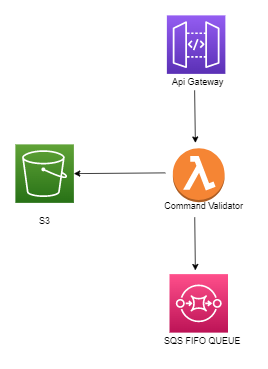

# Lambda CommandValidator

This repository contains the code for the lambda dedicated to validate the command received for the logistic-backbone platform.

## Project Structure

The project follows the [Standard Go Project Layout](https://github.com/golang-standards/project-layout). Test files are written in every directory (es. internal has the both the application go files both the test ones)

- **./configs/**
    json used for configuration to upload on s3 
- **./internal/** 
    business logic specic to the application
- **./cmd/main.go**
    starting point of application
- **Taskfile.yaml**
    task file for recurring commands 
    
## Taskfile

In the repository there's the taskfile with commands alias that help us during development. Here's the list of them:

- **build**
         build go binary
- **zip-linux**
        zip go binary on linux systems
- **zip-win**
        zip go binary on windwos systems
- **update-deploy**
        deploy zip on lambda

## Configuration

### JsonSchema

on  **./configs/** folder we have json schema used for validation

### Environment Variables

The following table shows the environment variable required by the lambda for configure the necessary for what it needs

| Key                               | Value                                                                                     |
| --------------------------------- | ------------------------------------------------------------------------------------------|
| COMMAND_ORIGIN                    | "Define wicth command we want walidate - External / Internal"                             |
| CONFIG_VERSION                    | "Versioning of jsonschema"                                                                |
| S3_BUCHET_NAME                    | "S3 Buchet Name"                                                                          |
| S3_CONFIG_PREFIX                  | "Configuration Folder"                                                                    |
| SQS_DLQ_NAME                      | "SQS DLQ Queue Name"                                                                      |
| SQS_QUEUE_NAME                    | "SQS Queue Fifo Name"                                                                     |
| MESSAGE_GROUP                     | "Message group for fifo sqs queue"                                                        |
| COMMAND_API_PATH_MAP_ENABLED      | "If true, command validator uses a config file to check command type - api path match"    |
| COMMAND_API_PATH_MAP_FILENAME     | "filename of config file used to check command type - api path match"                     |